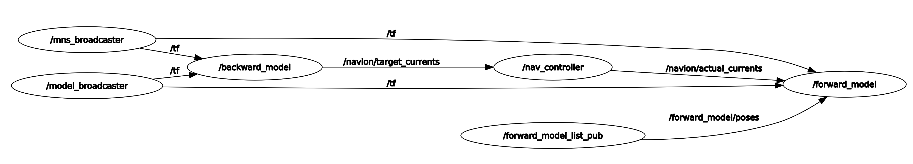

# hk_mrc
ROS packes used to interface with the Navion installed in the Multi-Scale Medical Roboics Center in Hongkong

 <table border = "0">
     <tr>
         
     </tr>
     <tr>
         
     </tr>
 </table>
 
 
## Launch files

### navion2.launch

Interfaces with Navion without GUI. The control of the field is performed with a PS4 controller or by publishing .

## RViz plugins

#### Usage

The user can use the following controls from the panel:

* Go grom READY to RUN state and start pushing currents: click on "Start" (calls the service `navion/start_running` with req. `True`)
* Go from RUN and READY state and stop pushing currents: click on "Stop" (calls the service `navion/start_running` with req. `False`)
* Recover from an error state: click on "Acknolwedge error" (calls the service `navion/reset_system`)
* Change the logging modulus: set the modulus in the spin box and click "Set log mod." (calls the service `navion/set_logging_modulus` with the provided modulus)

### Topics

#### Subscribed

Target currents in each coil in A.

* **`navion/target_currents`** ([mag_msgs/CurrentsStamped])

Desired magnetic field.

* **`backwards_model/field`** ([mag_msgs/FieldStamped])

#### Published

Actual magnetic field.  

* **`navion/actual_field`** ([mag_msgs/FieldStamped])

Actual measured currents in each coil in A.  

* **`navion/actual_currents`** ([mag_msgs/CurrentsStamped])

Actual state of the system as defined by the enumeration `navion::nav_control::NavionState`

* **`navion/actual_state`** ([std_msgs/UInt8])

System report.

* **`navion/system_report`** ([nav_controller/systemreport_navion2])

### Services

Run the system

* **`navion/start_running`** ([std_srvs::SetBool])

Acknowledge the errors in fault state to reset the system

* **`navion/reset_system`** ([std_srvs::Trigger])

Set the modulus for the log

* **`navion/set_logging_modulus`** ([nav_controller::msgSetLogMod])

### Messages

Currents

* **`mag_msgs/CurrentsStamped`** ([float64[] currents])

Magnetic field 

* **`mag_msgs/FieldStamped`** ([Field field])

Magnetic field vector

* **`mag_msgs/FieldStamped`** ([geometry_msgs/Vector3 vector, geometry_msgs/Point position])
